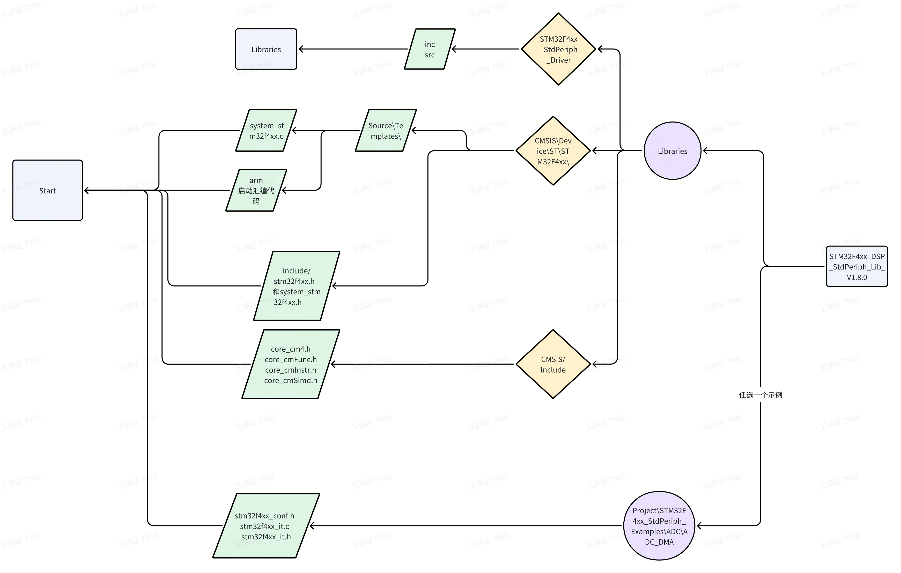
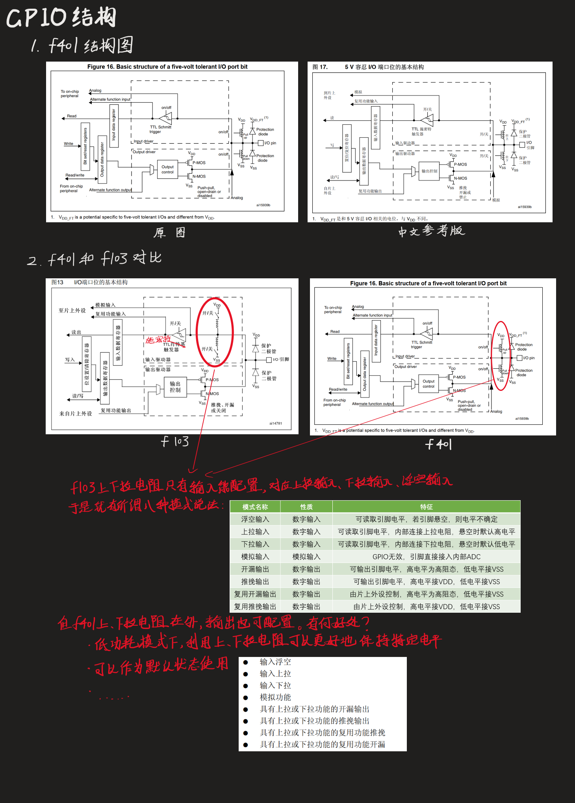
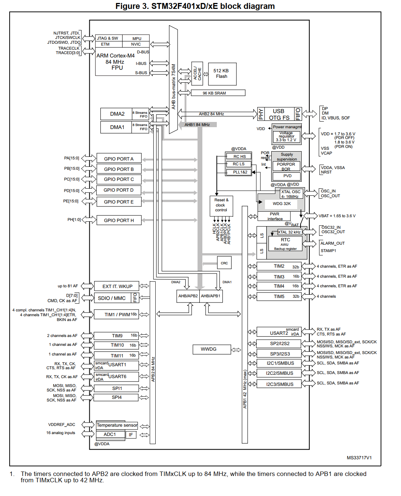
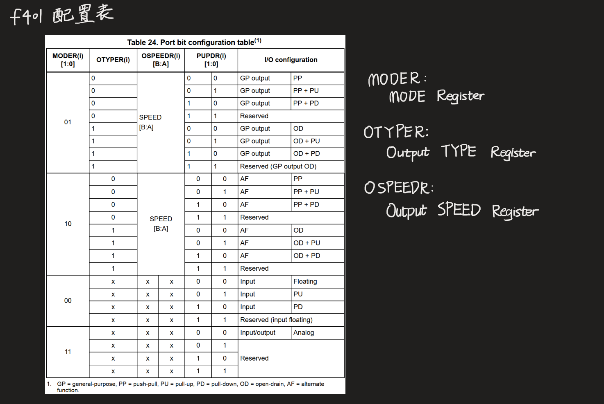
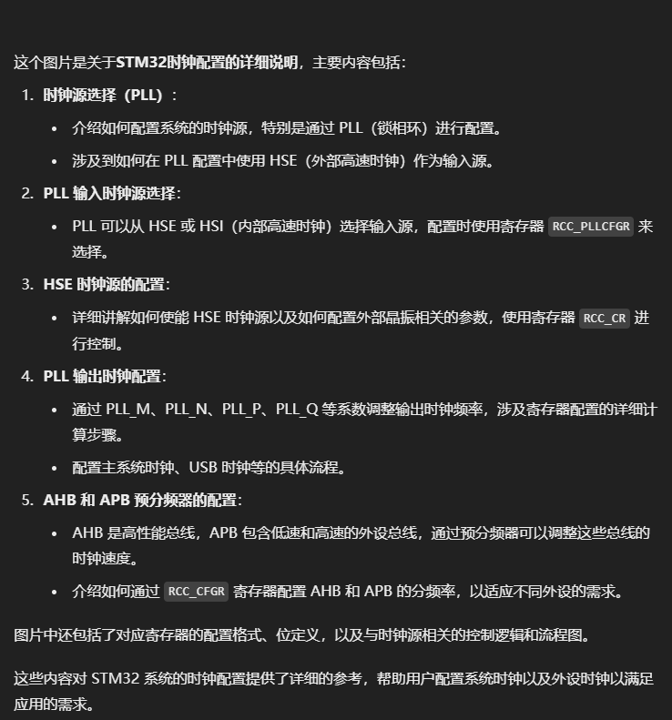
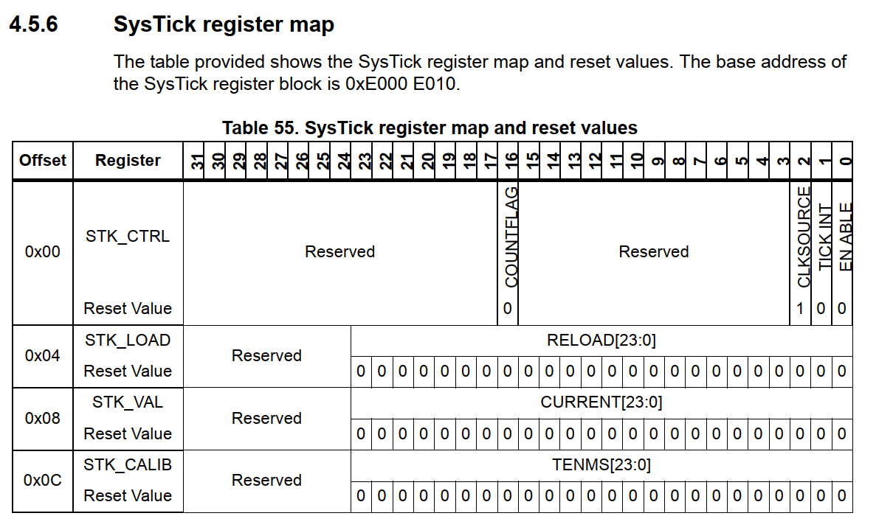
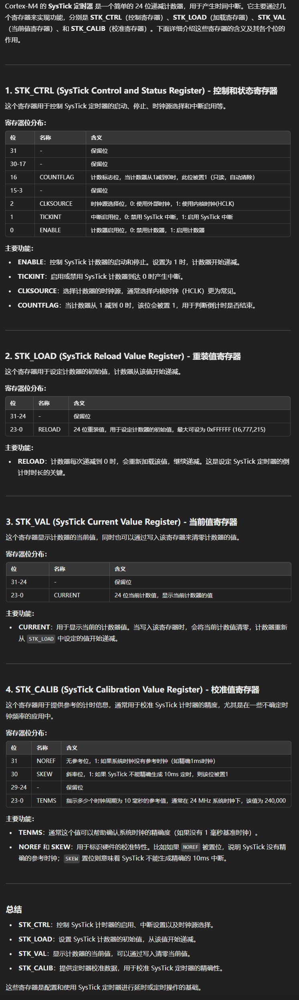
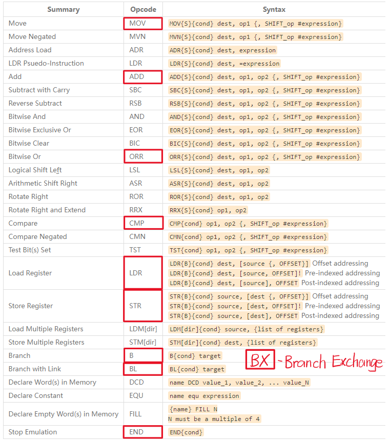

# 伍仁济

## 挑战点1 用 keil 点亮 STM32 的灯并使之闪烁
### 一、新建工程
介绍一下固件库都是啥：


注：
- stm32 f401re 没得 fmc 和 fsmc 硬件资源，要删掉对应文件；
- 有些时钟的遗留别名要注释掉
### 二、点灯
#### 1. 标准库函数
和 f103 不同，f401 的 GPIO 结构略有不同。

代码略，可见文件。
#### 2. 直接配置寄存器
首先**配置时钟**，见图

可知 GPIOA 是连接在 AHB1 总线上的。

AHB（Advanced High-performance Bus）用于连接高性能、高带宽的外围设备（如主存储器、DMA 控制器、以及高速外设）与处理器核心的高速总线。它是 ARM AMBA 总线架构中的核心总线。

APB（Advanced Peripheral Bus）通常用于低功耗、低带宽的外设（如 USART、I²C、SPI 等）与处理器之间的通信。
```C
RCC->AHB1ENR |= (1 << 0);
```

再**配置 GPIO 口**，先看表：

然后一个个查对应寄存器，最后写出：
```C
GPIOA->MODER &= ~(3 << (5 * 2));  // 清除 PA5 模式寄存器值
GPIOA->MODER |= (1 << (5 * 2));  // 配置 PA5 为输出模式
	
GPIOA->OTYPER &= ~(1 << 5);

GPIOA->OSPEEDR |= (3 << (5 * 2));  // High Speed 模式， 即50MHz（2 25 50 100）

GPIOA->PUPDR &= ~(3 << (5 * 2));
```
**什么时候用``|=``，什么时候用``&= ~``?**
- 用``|=``：当你要设置某些位为1时（如启用某个外设、设置引脚为高电平等）。
- 用``&=``和``~``：当你要清除某些位为0时（如禁用某个外设、清除某个标志位、清除引脚配置等）。

最后配置**Delay 函数**，先要了解系统时钟：

其实这个图还没细看，感觉她用了很多中文版的参考手册，不晓得对不对（主要是因为我是真跟不上）。gpt 也来看了下，他如是说：

利用江科大的 f103 的实现方式，直接配置寄存器实现 Delay 函数如下：
```C
void Delay_us(uint32_t xus)
{
    SysTick->LOAD = (SystemCoreClock / 1000000) * xus - 1;
    SysTick->VAL = 0;
    SysTick->CTRL = SysTick_CTRL_CLKSOURCE_Msk | SysTick_CTRL_ENABLE_Msk;

    while (!(SysTick->CTRL & SysTick_CTRL_COUNTFLAG_Msk))
        ;

    SysTick->CTRL = 0;
}

void Delay_ms(uint32_t xms)
{
    while (xms--)
    {
        Delay_us(1000);
    }
}

void Delay_s(uint32_t xs)
{
    while (xs--)
    {
        Delay_ms(1000);
    }
}
```
**SysTick是啥子？**

注：本图截自 Cortex-M4 手册里的内核外设章节中。这些存储器不是由stm32 提供的，而是由 Cortex-M4 提供的。而且byd还不解释这些是个啥（至少我是没看到）

还好有 gpt。
#### 3. 汇编语言
在 Cortex-M4 汇编中，代码规范和基本格式遵循 ARM 的汇编语言标准。Cortex-M4 的汇编语言基于 ARMv7-M 架构，使用的是 Thumb 指令集。
**基本文件结构**
汇编文件的基本结构包含文件的头部、代码段声明、入口点、函数声明和指令等内容。
```C
.syntax unified           // 使用统一汇编语法
.cpu cortex-m4            // 指定目标 CPU 为 Cortex-M4
.thumb                    // 使用 Thumb 指令集

.global main              // 导出符号 main，让链接器可以找到程序的入口

// 定义代码段
AREA MyCode, CODE, READONLY
ENTRY                     // 指定程序的入口

main:
    // 主程序开始

    B main                // 无限循环

```
但，如果在本次试验中写入这几行：
```C
.syntax unified           // 使用统一汇编语法
.cpu cortex-m4            // 指定目标 CPU 为 Cortex-M4
.thumb                    // 使用 Thumb 指令集

.global main              // 导出符号 main，让链接器可以找到程序的入口
```
会有问题。
1. 要用 ``EXPORT __main``而不是``.global``。这俩功能相同，只是在不同汇编器中使用不同的关键词。  ``EXPORT``更加适用于 ARM 汇编语言标准，而``GLOBAL``更常用于 GNU 汇编标准。
2. gpt 说：
   即使没有``.syntax unified``、``.cpu cortex-m4``和``.thumb``，你的汇编程序依然能在 Keil5 上运行，因为：
   - Keil5 默认已经使用了 Cortex-M4 和 Thumb 指令集。
   - AREA 和 EXPORT 指令足以确保代码段和入口点的正确配置。
    
    但我不知道为什么不能有了。

**__main 和 main 的区别：**
__main 负责系统初始化工作，而 main 是用户编写的代码部分，包含应用的主要逻辑。

**基本的汇编语言指令：**

**与 BX 相关的概念-LR：**
LR，即 Link Register。
作用：存储函数调用的返回地址。
工作原理：在调用子程序时，当前指令的下一条指令地址会自动存入 LR，以便在子程序结束后使用 BX LR 返回到调用前的代码位置。

Delay 函数的话，还没整称头，先用反复 +1 +1 拖延他的时间来实现吧。